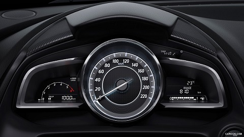
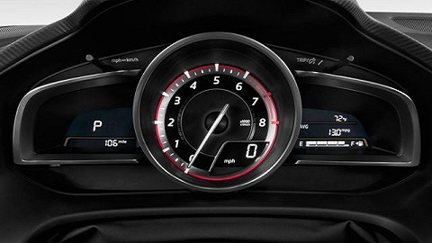
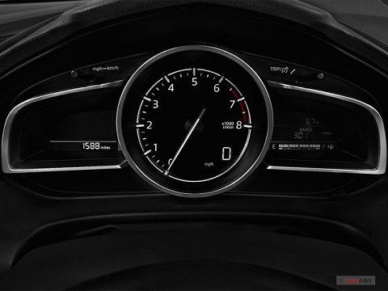
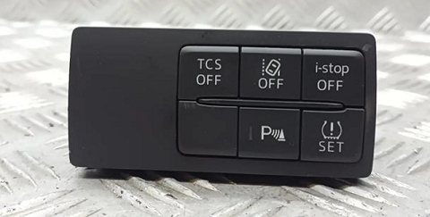

# Mazda 3 InstrumentCluster CAN MITM module
## _IC harness plug-in that allows a BN cluster to function in the BM car_

If you own a 3rd gen Mazda 3 BM (2013-2016, pre-lift) and prefer the clean look of the BN (2016-2018, post-lift) cluster, you are in luck. Some people on forums have tried to swap the cluster (mechanically and connector-wise they are compatible), just to realise that several functions stop working even after reprogramming a correct as-built configuration. 
Well, lets just say that I'm stubborn and got a good deal on a BN cluster.

> [!NOTE]
> Prototype in progress, stay tuned.
> Tests should wrap up before december 2024

# Tools and know-how you will need

There will be some soldering, so a decent iron and preferrably a hot air station.
There may be some EEPROM flashing - so something to read/write a 93xx series chip.
There will be a custom PCB with an STM32 MCU - you will need something to program it (ST-LINK, a Nucleo board, J-LINK, etc).
For the cleanup afterwards, you will need to write the correct cluster configuration (as-built) - an ELM-327 OBD reader (preferrably with HS/MS CAN switch) and Forscan. If you're new and don't know what that means, go to https://www.mazda3revolution.com/ and look up 'as-built configurations' and the excellent Excel sheet made by user 'SergSlim'.

# Cluster Hardware versions

There are several types of clusters and HUDs (or ADDs as Mazda calls them, I won't) which may or may not be compatible with your car and with each other. I won't go into too much detail here, but be wary of that when you buy yours. 

* The cluster may be for the BM or the BN version,
* It may or may not have (or at least support) a HUD (some used parts sellers may try to sell them separately),
* it may have a cetrally located, analog tachometer or speedometer
* it may be for a diesel or petrol car (different tachometer range)
* in the case of central speedometer - it may be scaled in km/h or in both kilometers and miles

Additionally, there are (I think) 3 HUD versions: monochrome/colored one for the BM, and a colored one for the BN (different from the BM one!)

   

   

   

What i personally used? I have a 2014 BM petrol car (originally no HUD, central speedometer), and moved to a cluster for a petrol BN version with central tachometer and HUD.
Original IC part number: BHR1 55 430, new one: **don't remember, will check**.

# What actually happens if you just... plug it in?

Depending on the hardware version (trim) mismatch between the donor and your car, you will get some (or a lot) of warnings and some functions simply won't work. Once you fix them (by writing a correct as-built config) to your new cluster and clear the DTCs, you'll need to tackle the incorrect odometer reading (in practice, fix the odometer FIRST). 

> [!WARNING]
> This is a relatively easy fix, but I have to mention that in some countries "rolling-back" the odometer values is criminal. We are not doing this here, but you might be tempted to just as well do that since its easy at this point. DO NOT. Your car will not break because of this, but the value itself is stored in several places other than the cluster assembly. You will not gain anything by this, other than being an asshole when selling the car and potentially getting a hefty fine.

Some stores feature tools to change this value via OBD, but i do not have one on hand and they seem too expensive for the task. The odometer value is stored on an 8-pin 93xx SPI EEPROM IC on the cluster PCB (back side, no need to take the needle out), close to the main processor (you will not miss it). You can just swap the chip between the clusters and fix the as-built afterwards (its on the EEPROM as well, at least partially), or you can re-flash the contents with the corrected odometer value. In my case - memory chips were in drastically different packages, so i have re-flashed the chip with corrected odo value. I have also tested swapping them just for curiosity, and it has worked fine.
Disassembly of the cluster is very easy, no instructions needed. Once you desolder and read the memory, here is where the odometer value is stored - copy it from the original cluster memory and replace that section in the donor. 

The encoding of this value is not mentioned here on purpose - do not manipulate it for reasons stated above.
You may ask - what about the VIN? Nothing really. It is also stored in the EEPROM, but you can easily change it when updating the as-built config.

This is the extent to which others on forums have arrived - no DTCs (if you squint) and everything is just as it was with the old cluster! Sort of.
When you finally start your car, you will start noticing the discrepencies. 

****

##### 1. First (most noticable) - the tachometer reading is off. 

It appears to be roughly 2x too high, up until ~2200 rev/min where it just gets stuck and doesn't go up further.
This is due to the PCM in the BN car using a slightly different CAN packet structure to broadcast the current RPM value. Strangely enough - the same CAN frame also contains the speed value which (at least in my case) works just fine. I don't really know why mazda would do this, other than out of pure spite. This is the part that is most troublesome in the entire journey with this cluster, and necessitates additional hardware.

##### 2. The info buttons do not work correctly (you use it to cycle through the screen on the right).

This one is fairly easy - the BN has a different steering wheel (with different buttons). On the BM wheel - the info button works as an up/down arrow and a central button. On the BN wheel - the up/down buttons are gone and only the central push of the info button works. The buttons are sampled by Start-Stop unit, and sent to the cluster via CAN. After looking around with an OBD scanner, it appears that the BN Instrument Cluster registers the up/down arrows, but only reacts to the central info button push.
You can just get used to it (its a minor thing to be honest), modify the switch assembly (short the buttons) so pressing either always triggers the middle one, or fix it in the same manner as issue number 1 (on that-later).

   

##### 3. You still get one more DTC - the buttons (refered to as Cluster Switch by Mazda) on the door side of the steering wheel do not work

The DTC (U2013:13) will tell you that there is an open circuit in the harness or in the switch itself - which is correct.
When rummaging through the internet, I have not found complete BN wiring diagrams (only for BM), but fortunaletly Mazda has put relevant snippets in the workshop manuals for both cars. Well, the connector itself is compatible, but one of the cluster pins has been changed. Additionally, the cluster switch itself differs slightly between BM and BN.

*There may be additional issues, once I personally have not observed at this point, in my trim version.

# What now?

Time to start tackling the issues, going from the back:

#### Cluster switch problems

First, the open circuit DTC. Here are wiring diagrams for both the BM and BN versions:

As you can see, while the V-B cable remains unchanged, the T-C one does not. In the BM version, it is connected to ground internally within the Instrument Cluster.
To test that, you can pop out the T pin out of the Instrument Cluster harness plug, and connect it to car chassis/ground. This is handled by the PCB discussed later so there is no need to physically alter the plug or wires in the harness.

Now, to the hardware differences. Here are some pictures of switch clusters found in BMs:

   

And here are ones found in BNs:

   

Notable differences: 
* The RVM button comes in two styles (bottom left on the BM pictures),
* The TPMS and Lane assist buttons are swapped between BM and BN (in BM: top-middle and bottom-right respectively),
* BM has an AFS button, while BN has a parktronic button.

Due to future plans, I needed the version with all 6 buttons. However, I could not find ANY fully populated BN switch clusters on the used market. So as a workaround, I have bought an almost fully populated BM switch cluster (5 out of 6 buttons), and moved the one missing button from my original switch cluster (together with associated resistor and LED). You can easily disassemble them, and the plastic buttons just pop out (they are not on a single solid membrane). To fix the button order (swapped TPMS/Lane assist), i have simply cut the traces and added wire jumpers to make the buttons in "correct" order.
Here is what the insides look like (pictures are not mine):

   

Red circles are the missing parts that needed to be moved from the original switch cluster, purple circles are populated if you have manual beam control (like below).

> [!WARNING]
> **THE LEDs CHOOSEN BY MAZDA ARE VERY FRAGILE TO HEAT**
> In my case - failure rate when desoldering was about 33%

I have verified with an OBD scanner, that my BM (with BN cluster and correct as-built) does in fact register the AFS button as an AFS button (not parktronic, as it should be in BN). This may be due to resistance values, but could not verify further.

#### The Info button and engine RPM 

Both issues require the same solution: a way to intercept certain CAN payloads and alter them, before they get to the Instrument Cluster, and in a way that will not broadcast them to the rest of the systems. To do this, I designed a simple harness extender with an MCU performing a man-in-the-middle attack on the HS CAN line. The component choices are simple - it is what I had on hand and was familiar with. There are existing CAN MITM devices on the market - and are either really badly designed, bloated, underpowered, overpriced, or all of those at once.

To test the idea, I took both Instrument clusters, few devkits, powered them on the bench and started working out the CAN differences.
As a point of reference: several forums/repositories contained (at least some) CAN packets for the Mazda 3 BM, gen 1 (older), and RX8 (no BN unfortunaletly). As far as I could see, the RPM/Speed data is supposed to be transmitted with an ID=0x202 (0x201 in older gen) - and that worked perfectly for the original Cluster. With the new one, however, only speed was set and the RPM remained perfectly still at a round value of 0. Well, a few minutes of brutal scanning did wonders - the BN version transmits the RPM value with an ID of 0x130, as a 13bit value at offset of 43 (bytes 5-6). Unfortunately, the 0x130 payload appears to be also used for other means (since the RPM needle moved at all in the car), so we can not simply make it up. According to [this repository](https://github.com/silverchris/Mazda3_Canbus_Messages/blob/main/skyactive.kcd), there is an "unused" (or rather, undecoded) section right where we need to inject the 0x202 RPM contents - the other fields may be used by the Instrument Cluster so it would be wise to keep them.

For the info button, the metodology was the same. [Here](https://github.com/majbthrd/MazdaCANbus/blob/master/skyactiv.kcd), the INFO- and INFO+ keypresses are marked at 58/59 offset with ID=0x274. For the old cluster - that works perfectly confirming where we should expect this information to be broadcasted. For the new cluster, **TODO**.

****

To summarize, the device shall:
* pass through all HS CAN packets from the Cluster to the rest of the car
* for the HS CAN packets in the opposite direction (to the Cluster):
    * extract RPM value from ID=0x202 (bytes 0,1) payload
    * inject RPM value into ID=0x130 (bytes 5,6) payload
    * Alter the ID=0x274 so that info button appears pressed, whenever info/up/down are pressed
    * pass through all remaining packets

## Installation

The cluster itself:
1. buy one that you like,
2. swap the EEPROM chip from your old cluster OR reflash it with your old odometer value,
3. connect it to your car, write the correct as-built configuration, clear DTCs (you may need to clear them several times).

Cluster Switch assembly:
1. depending on your version/ what you need - do nothing, or buy a new (BM or BN) cluster and maybe move some parts between them,
2. if you decide to stay with a BM cluster - rewire (swap) TPMS/Lane assist buttons.

MITM module:
1. order the PCB or etch it yourself (cheaper well-known vendors: allpcb, pcbway, jlcpcb), 
2. buy the required components (BOM + harness extender) and solder them,
3. flash the firmware onto the board,
4. **TEST IT IN THE CAR**,
5. optional: apply conformal coating,
6. add a 3D printed case or large diameter heatshrink tube,
7. mount in the car.

> [!NOTE]
> Regarding the components - the ones I choose are rated to -40degC because it gets cold here, you may not need that range. Some P/N may be obsolete - feel free to use anything that matches the value & voltage ratings. And please, do use a fuse and not a 0R resistor.

Aside from components listed in BOM, you need to buy a chinese 24pin automotive harness extender - much cheaper and easier than making your own (for reference: harness plug PN is [TE 1318917-1](https://www.te.com/en/product-1318917-1.html)). Cut the wires corresponding to pins: U,B,D,T,K,A (roughly in the middle), strip about 2-3mm off each end. Solder the wires onto the PCB as marked on silkscreen.

At this point - flash the firmware and test it in the car to verify that all is soldered properly. Now, this is likely overkill, but consider adding a conformal coating. Depending on your region, you may get slight condensation on the board. If you do - remember to mask the programming header and TEST IT FIRST.

A simple 3D printed case is included in the project, but you can also use a large heatshrink tube. In both cases - consider adding some padding and/or securing it to the cluster itself. A loose box/board may bounce off things and make annoying sounds.

Regarding removing the instrument cluster and cluster switch - consult the workshop manual. Youtube is your friend as well.
ENJOY!

## Future notes

##### Cluster switch
It would be very easy, to correct the Cluster Switch BM-BN difference with this board - I didn't, because new switches were needed for something else as well, and I'm not bothered by modifying car modules. If you have a complete cluster and do not want to tamper with it (swap TPMS/Lane assist on the PCB itself by cutting traces), you can modify my board to do this for you.
* you will need to use the V Instrument Cluster harness pin as well
* bias it with some voltage and resistance
* connect it to an ADC pin in the STM32 MCU
* sample it in the firmware
* recreate the cluster switch circuit, but instead of hardware buttons use NMOSfets driven by MCU
* mirror the behaviour between the ADC and NMOSfet 'switches'
* voila

##### HUD
The HUD can work with Mazda Navigation to display directions, but for some reason does not work with the Android Auto navigation. I am fairly certain, that the CMU sends certain CAN messages to display those directions, and it would be possible to merge AA navigation with HUD. I leave it for the future, maybe someone will take a crack at this before me.

## Meta

Krzysztof Belewicz – belewicz@protonmail.com  
The [license](https://github.com/CannaCardo/Mazda3_IC_MITM/blob/main/LICENSE) lets you freely use it, enjoy.
